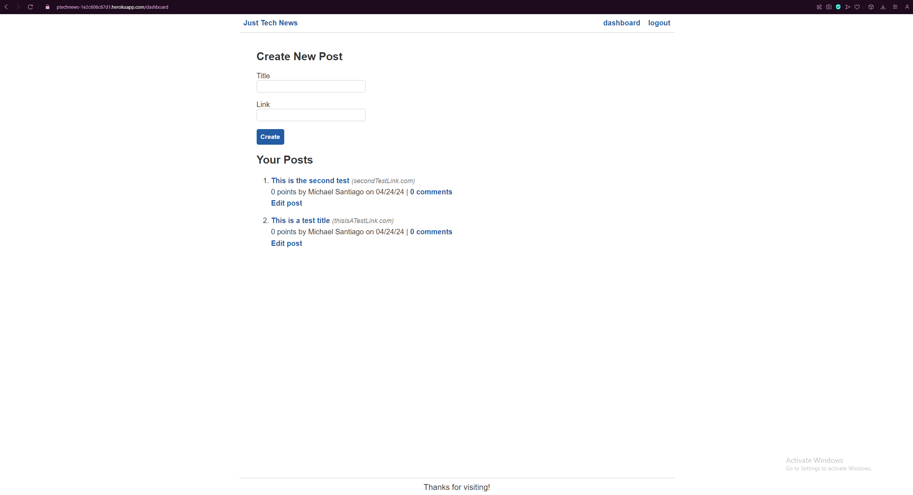

# Tech News
    
## Description
    
A hub where like-minded tech nerds can share articles and other online media with each other

## Screenshot

## Deployed Application

https://ptechnews-1e2c606c87d1.herokuapp.com
    
## Table of Contents
    
- [Installation](#installation)
- [Usage](#usage)
- [License](#license)
- [How to Contribute](#contributing)
- [Test](#test)
- [Questions](#questions)
    
## Installation
    
N/A
    
## Usage
    
Once you are on the page you can view other people's post. To make your own and to comment/upvote others you will need to login by selecting 'login' at the top and entering your information. You can then head to your dashboard to create, edit or delete a post.
    
## License
    
MIT License
    
## Contributing
    
N/A
    
## Test
    
N/A
    
## Questions
    
My Github account is [GitHub.com/midasantiago](github.com/midasantiago)
    
If you wish to contact me you can do so at mida.santiago98@gmail.com